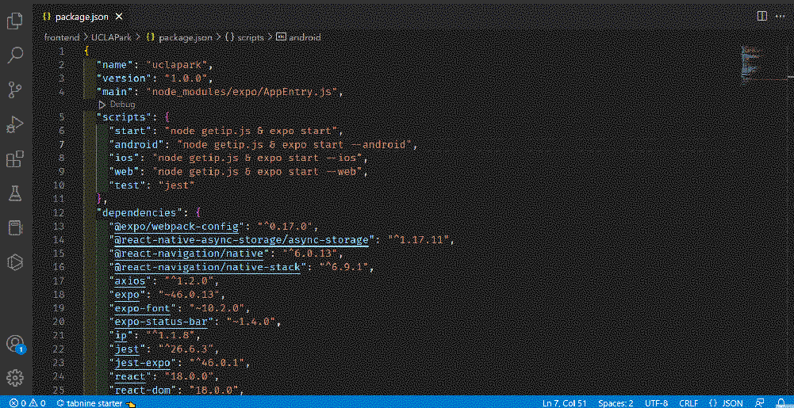

# npm-dependancy-graph README

This extension allows developers who use npm to visualize the dependencies of their npm project and the vulnerabilities that haunt it. 

## Features

---

### **Display Full Dependency Graph**

> This feature allows the user to see the whole dependency graph of their project. It displays all connections and does not contain duplicates.

> Access it through the editor context menu or title menu via either `package.json` or `package-lock.json`. Menu Option should be `"Visualize Full NPM Dependency Graph"`.

### **Display Expandable Dependency Tree**

> This feature allows the user to expand and visualize the dependency tree as they please. It is in DAG form so it does contain duplicates. *Note: This is done for the sake of removing complexity*

> Access it through the editor context menu or title menu via either `package.json` or `package-lock.json`. Menu Option should be `"Visualize Expandable NPM Dependency Tree"`.

### **Display Full Vulnerability Graph**

> This feature allows the user to see the whole dependency graph of their project with color coded values that show vulnerability levels. 

> Access it through the editor context menu or title menu via either `package.json` or `package-lock.json`. Menu Option should be `"Visualize NPM Vulnerabilities"`.

---

## Requirements

* You must have node installed. https://nodejs.org/en/download

* You must have all node modules of your project installed in order to display the graphs. Run `npm i` in your project directory to install the dependencies and display them. The extension will warn you if you do not have them installed.

* To access the menus shown in the demos, you may only do so through either `package.json` or `package-lock.json`.

## Extension Settings

This extension does not expose any settings yet but it may in the future.

## Known Issues

* When visualizing vulnerabilities, your program may contain multiple instances of the same package in different versions. The graph may indicate a vulnerability on a version of a package that has since patched the vulnerability but another package is using an old vulnerable version of the afformentiond package. 
* The graph links might be hard to visualize on light-mode editors as the links are colored white by default.

## Release Notes

### 1.0.0

Initial release of npm-dependancy-graph

---

## Dev TODO List:
* Fix known issues
* Refactor code
* Improve performance
* Improve GUI
